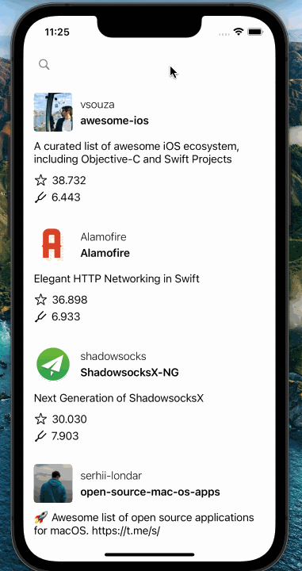

# GitHub Explorer

Browse repositories on GitHub from your iOS device

### Built with

- UIKit, Xib, AutoLayout
- MVVM-C Architecture
- [RxSwift](https://github.com/ReactiveX/RxSwift)
- [Alamofire](https://github.com/Alamofire/Alamofire)
- [Kingfisher](https://github.com/onevcat/Kingfisher)
- [Cocoapods](https://cocoapods.org)
